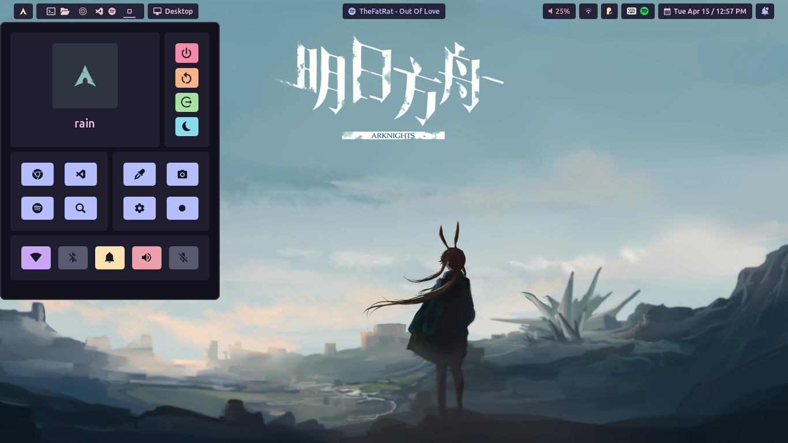

## My custom hyprland

### Preview
waybar

hyprpanel

<!-- ### Dependencies -->

    
Package

    <ul>
        <li><a href="https://github.com/hyprwm/Hyprland">hyprland</a></li>
        <li><a href="https://github.com/catppuccin">catppuccin</a></li>
        <li><a href="https://github.com/Alexays/Waybar">waybar</a></li>
        <li><a href="https://hg.sr.ht/~scoopta/wofi">wofi</a></li>
        <li><a href="https://github.com/mortie/swaylock-effects">hyprlock</a></li>
        <li><a href="https://github.com/Mange/rofi-emoji">rofi-emoji</a></li>
        <li><a href="https://github.com/ryanoasis/nerd-fonts">neft-font</a></li>
        <li><a href="https://hyprpanel.com/">hyprpanel</a></li>
        <li><a href="https://github.com/ArtsyMacaw/wlogout">wlogout</a></li>
        <li>...</li>
    </ul>

